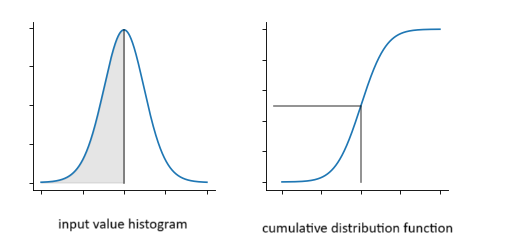

  

# Learnable Activation Function
Implementation of Learnable Activation Function.

  

On each node, we will calculate the cumulative distribution function (sparse if possible). This can be done via the histogram, or (if possible) more efficiently (to discuss). 
By default, the CDF is bound to (0, 1), like Sigmoid activation function. Similar to batch normalization, we can introduce two learnable parameters, gamma and beta, to scale and shift the activation function, making it flexible from bounded to quasi-unbounded (scale) [cite] as well to learn to avoid non zero mean. [cite]

## Installing package locally in editable mode
> pip install -e .

## Running examples

> PYTHONPATH=modules python examples/simple_model/train.py

## Licence
MIT licence.
